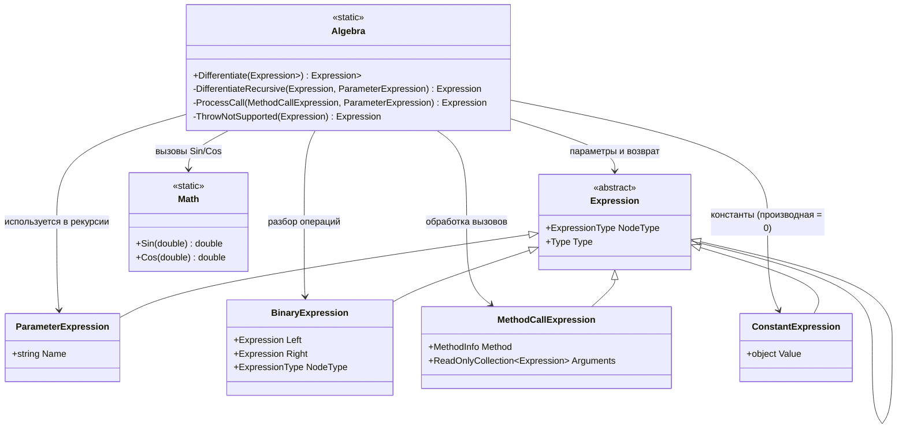

```mermaid
classDiagram
    %% основной класс
    class Algebra {
        <<static>>
        +Differentiate(Expression<Func<double, double>>) Expression<Func<double, double>>
        -DifferentiateRecursive(Expression, ParameterExpression) Expression
        -ProcessCall(MethodCallExpression, ParameterExpression) Expression
        -ThrowNotSupported(Expression) Expression
    }

    %% базовые классы
    class Expression {
        <<abstract>>
        +ExpressionType NodeType
        +Type Type
    }

    class Expression~TDelegate~ {
        <<abstract>>
    }

    class ParameterExpression {
        +string Name
    }

    class BinaryExpression {
        +Expression Left
        +Expression Right
        +ExpressionType NodeType
    }

    class MethodCallExpression {
        +MethodInfo Method
        +ReadOnlyCollection~Expression~ Arguments
    }

    class ConstantExpression {
        +object Value
    }

    %% класс Math 
    class Math {
        <<static>>
        +Sin(double) double
        +Cos(double) double
    }

    %% Наследование 
    Expression <|-- Expression~TDelegate~
    Expression <|-- ParameterExpression
    Expression <|-- BinaryExpression
    Expression <|-- MethodCallExpression
    Expression <|-- ConstantExpression

    %% Зависимости Algebra 
    Algebra --> Expression : параметры и возврат
    Algebra --> ParameterExpression : используется в рекурсии
    Algebra --> BinaryExpression : разбор операций
    Algebra --> MethodCallExpression : обработка вызовов
    Algebra --> ConstantExpression : константы (производная = 0)
    Algebra --> Math : вызовы Sin/Cos
```
