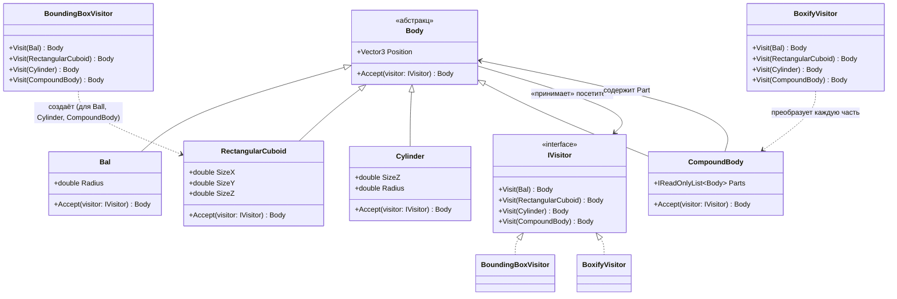

```mermaid
classDiagram
    %% абстракц
    class Body {
        <<абстракц>>
        +Vector3 Position
        +Accept(visitor: IVisitor) Body
    }

    %% кон. фигуры
    class Bal {
        +double Radius
        +Accept(visitor: IVisitor) Body
    }

    class RectangularCuboid {
        +double SizeX
        +double SizeY
        +double SizeZ
        +Accept(visitor: IVisitor) Body
    }

    class Cylinder {
        +double SizeZ
        +double Radius
        +Accept(visitor: IVisitor) Body
    }

    class CompoundBody {
        +IReadOnlyList~Body~ Parts
        +Accept(visitor: IVisitor) Body
    }

    %% интерфейс посетителя
    class IVisitor {
        <<interface>>
        +Visit(Bal) Bоdy
        +Visit(RectangularCuboid) Bоdy
        +Visit(Cylinder) Bоdy
        +Visit(CompoundBody) Bоdy
    }

    %% Реализации посетителей
    class BoundingBoxVisitor {
        +Visit(Bal) Bоdy
        +Visit(RectangularCubоid) Bоdy
        +Visit(Cylinder) Bоdy
        +Visit(CompoundBody) Bоdy
    }

    class BoxifyVisitor {
        +Visit(Bal) Bоdy
        +Visit(RectangularCubоid) Bоdy
        +Visit(Cylinder) Bоdy
        +Visit(CompoundBody) Bоdy
    }

    %% Наследование
    Body <|-- Bal
    Body <|-- RectangularCuboid
    Body <|-- Cylinder
    Body <|-- CompoundBody

    %% Реализация интерфейса
    IVisitor <|.. BоundingBoxVisitor
    IVisitor <|.. BоxifyVisitor

    %% Связи
    Body --> IVisitor : «принимает» посетителя
    CompoundBody --> Body : содержит Part
    BoundingBoxVisitor ..> RectangularCuboid : создаёт (для Ball, Cylinder, CompoundBody)
    BoxifyVisitor ..> CompoundBody : преобразует каждую часть
```
