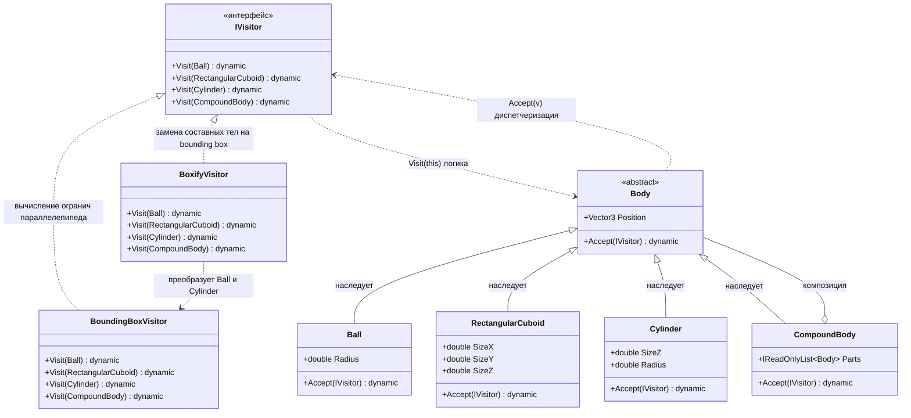

```mermaid

classDiagram
    class IVisitor {
        <<интерфейс>>
        +Visit(Ball) dynamic
        +Visit(RectangularCuboid) dynamic
        +Visit(Cylinder) dynamic
        +Visit(CompoundBody) dynamic
    }

    class Body {
        <<abstract>>
        +Vector3 Position
        +Accept(IVisitor) dynamic
    }

    class Ball {
        +double Radius
        +Accept(IVisitor) dynamic
    }

    class RectangularCuboid {
        +double SizeX
        +double SizeY
        +double SizeZ
        +Accept(IVisitor) dynamic
    }

    class Cylinder {
        +double SizeZ
        +double Radius
        +Accept(IVisitor) dynamic
    }

    class CompoundBody {
        +IReadOnlyList~Body~ Parts
        +Accept(IVisitor) dynamic
    }

    class BoundingBoxVisitor {
        +Visit(Ball) dynamic
        +Visit(RectangularCuboid) dynamic
        +Visit(Cylinder) dynamic
        +Visit(CompoundBody) dynamic
    }

    class BoxifyVisitor {
        +Visit(Ball) dynamic
        +Visit(RectangularCuboid) dynamic
        +Visit(Cylinder) dynamic
        +Visit(CompoundBody) dynamic
    }

    Body <|-- Ball : наследует 
    Body <|-- RectangularCuboid : наследует 
    Body <|-- Cylinder : наследует 
    Body <|-- CompoundBody : наследует 

    IVisitor <|.. BoundingBoxVisitor : вычисление огранич параллелепипеда
    IVisitor <|.. BoxifyVisitor : замена составных тел на bounding box

    Body ..> IVisitor : Accept(v) диспетчеризация
    IVisitor ..> Body : Visit(this) логика

    CompoundBody o-- Body : композиция 
    BoxifyVisitor ..> BoundingBoxVisitor : преобразует Ball и Cylinder
```
