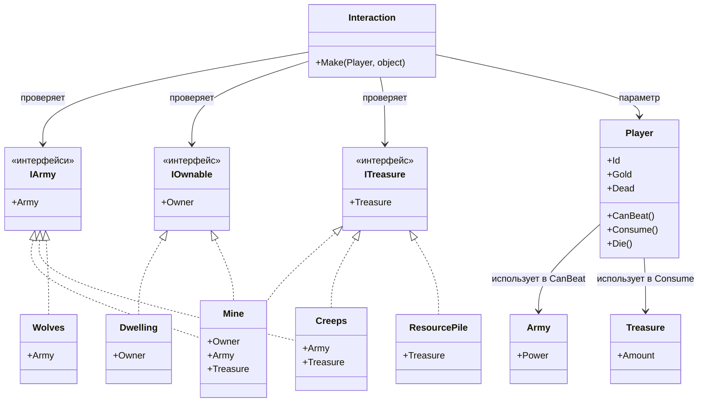

```mermaid
classDiagram
    class IOwnable {
        <<интерфейс>>
        +Owner
    }
    class IArmy {
        <<интерфейси>>
        +Army

    }
    class ITreasure {
        <<интерфейс>>
        +Treasure
    }

    class Dwelling {
        +Owner
    }
    class Mine {
        +Owner
        +Army
        +Treasure
    }
    class Creeps {
        +Army
        +Treasure

    }
    class Wolves {
        +Army
    }
    class ResourcePile {
        +Treasure
    }

    class Interaction {
        +Make(Player, object)
    }

    %% Внешние 
    class Army {

        +Power
    }
    class Treasure {
        +Amount
    }
    class Player {
        +Id
        +Gold
        +Dead
        +CanBeat()
        +Consume()
        +Die()
    }

    %% интерф
    IOwnable  <|.. Dwelling
    IOwnable  <|.. Mine
    IArmy     <|.. Mine
    IArmy     <|.. Creeps
    IArmy     <|.. Wolves
    ITreasure <|.. Mine
    ITreasure <|.. Creeps
    ITreasure <|.. ResourcePile

    %% Interaction
    Interaction --> IArmy     : проверяет
    Interaction --> IOwnable  : проверяет
    Interaction --> ITreasure : проверяет
    Interaction --> Player    : параметр

    %% связи Player 
    Player --> Army    : использует в CanBeat
    Player --> Treasure : использует в Consume
```
