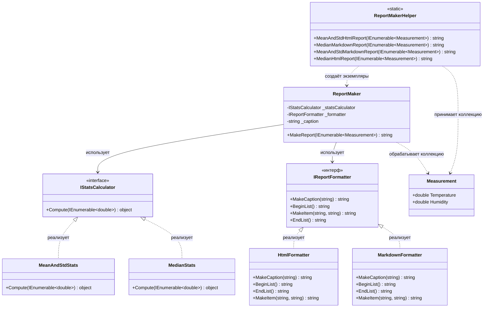

```mermaid
classDiagram
    %% Интерфейс для выч стат
    class IStatsCalculator {
        <<interface>>
        +Compute(IEnumerable~double~) object
    }

    %% pеализации стат
    class MeanAndStdStats {
        +Compute(IEnumerable~double~) object
    }

    class MedianStats {
        +Compute(IEnumerable~double~) object
    }

    IStatsCalculator <|.. MeanAndStdStats : реализует
    IStatsCalculator <|.. MedianStats : реализует

    %% интерфейс для формат отчёт
    class IReportFormatter {
        <<интерф>>
        +MakeCaption(string) string
        +BeginList() string
        +MakeItem(string, string) string
        +EndList() string
    }

    %% форматтер
    class HtmlFormatter {
        +MakeCaption(string) string
        +BeginList() string
        +EndList() string
        +MakeItem(string, string) string
    }

    class MarkdownFormatter {
        +MakeCaption(string) string
        +BeginList() string
        +EndList() string
        +MakeItem(string, string) string
    }

    IReportFormatter <|.. HtmlFormatter : реализует
    IReportFormatter <|.. MarkdownFormatter : реализует

    %% Основ класс отчётчика
    class ReportMaker {
        -IStatsCalculator _statsCalculator
        -IReportFormatter _formatter
        -string _caption
        +MakeReport(IEnumerable~Measurement~) string
    }

    ReportMaker --> IStatsCalculator : использует
    ReportMaker --> IReportFormatter : использует

    %% Вспомог класс со стат метод
    class ReportMakerHelper {
        <<static>>
        +MeanAndStdHtmlReport(IEnumerable~Measurement~) string
        +MedianMarkdownReport(IEnumerable~Measurement~) string
        +MeanAndStdMarkdownReport(IEnumerable~Measurement~) string
        +MedianHtmlReport(IEnumerable~Measurement~) string
    }

    ReportMakerHelper ..> ReportMaker : создаёт экземпляры

    %% вспомогательный тип данныx
    class Measurement {
        +double Temperature
        +double Humidity
    }

    ReportMaker ..> Measurement : обрабатывает коллекцию
    ReportMakerHelper ..> Measurement : принимает коллекцию
```
