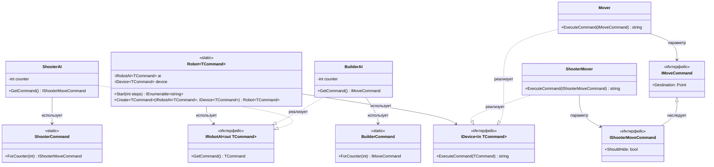

```mermaid
classDiagram
    %% Интерфейсы команд
    class IMoveCommand {
        <<Интерфейс>>
        +Destination: Point
    }

    class IShooterMoveCommand {
        <<Интерфейс>>
        +ShouldHide: bool
    }

    IMoveCommand <|-- IShooterMoveCommand : наследует

    %% Интерфейсы робота
    class IRobotAI~out TCommand~ {
        <<Интерфейс>>
        +GetCommand() TCommand
    }

    class IDevice~in TCommand~ {
        <<Интерфейс>>
        +ExecuteCommand(TCommand) string
    }

    %% Реализации AI
    class ShooterAI {
        -int counter
        +GetCommand() IShooterMoveCommand
    }

    class BuilderAI {
        -int counter
        +GetCommand() IMoveCommand
    }

    ShooterAI ..|> IRobotAI~IShooterMoveCommand~ : реализует
    BuilderAI ..|> IRobotAI~IMoveCommand~ : реализует

    %% Реализации устройств
    class Mover {
        +ExecuteCommand(IMoveCommand) string
    }

    class ShooterMover {
        +ExecuteCommand(IShooterMoveCommand) string
    }

    Mover ..|> IDevice~IMoveCommand~ : реализует
    ShooterMover ..|> IDevice~IShooterMoveCommand~ : реализует

    %% Обобщ
    class Robot~TCommand~ {
        -IRobotAI~TCommand~ ai
        -IDevice~TCommand~ device
        +Start(int steps) IEnumerable~string~
    }

    Robot~TCommand~ --> IRobotAI~TCommand~ : использует
    Robot~TCommand~ --> IDevice~TCommand~ : использует

    %% Статическая фабрика
    class Robot {
        <<static>>
        +Create~TCommand~(IRobotAI~TCommand~, IDevice~TCommand~) Robot~TCommand~
    }

    %% Вспомогательные генераторы 
    class ShooterCommand {
        <<static>>
        +ForCounter(int) IShooterMoveCommand
    }

    class BuilderCommand {
        <<static>>
        +ForCounter(int) IMoveCommand
    }

    ShooterAI --> ShooterCommand : использует
    BuilderAI --> BuilderCommand : использует

    %% зависимости 
    Mover --> IMoveCommand : параметр
    ShooterMover --> IShooterMoveCommand : параметр
```
